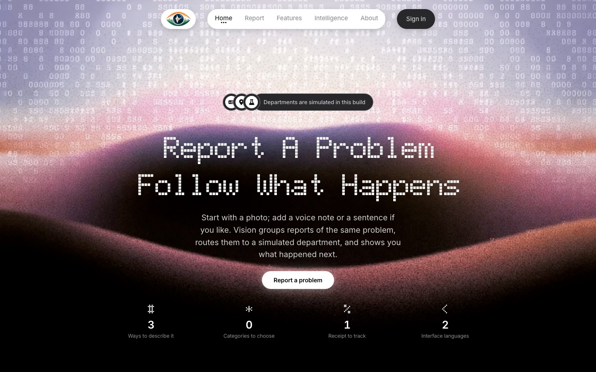
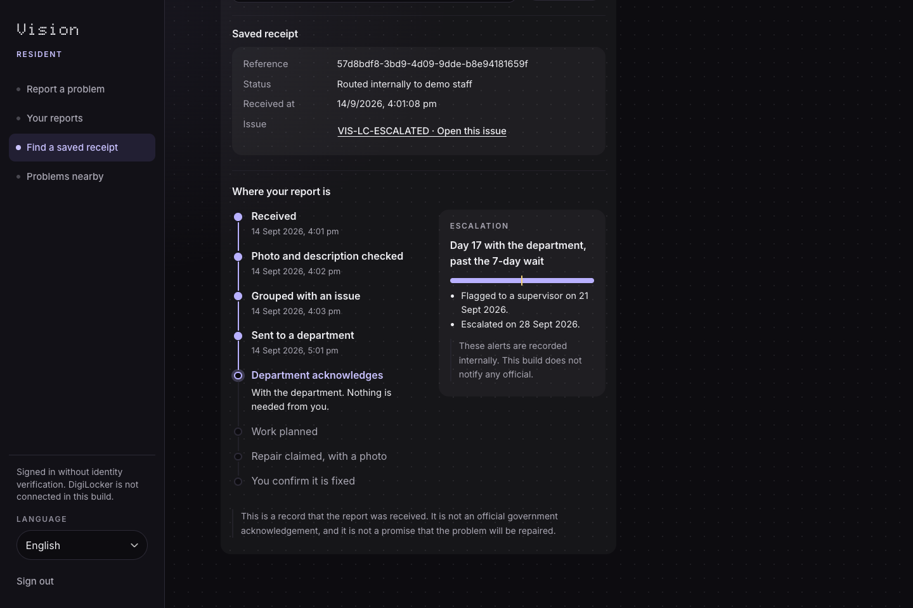
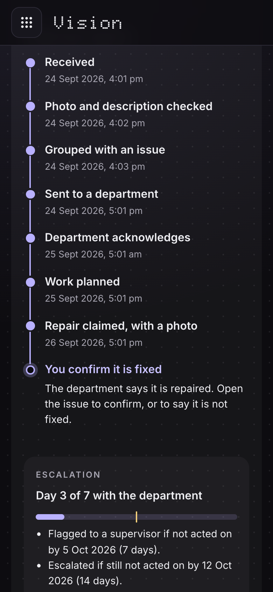
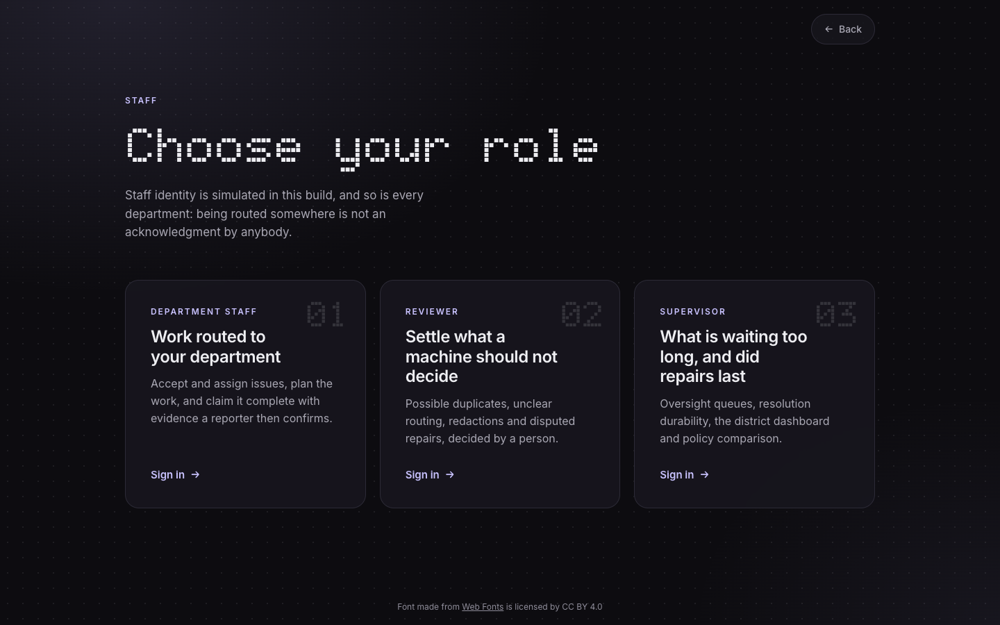
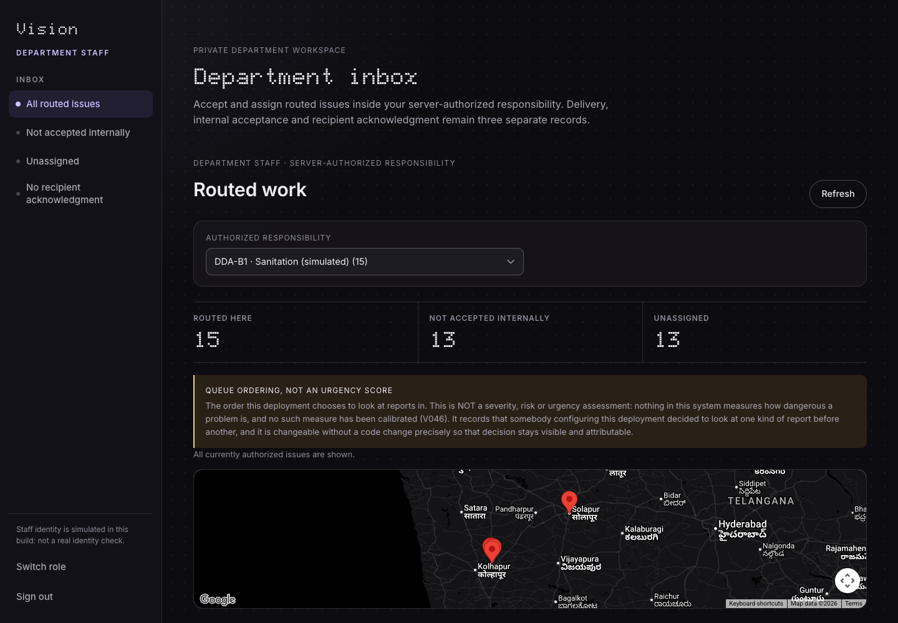
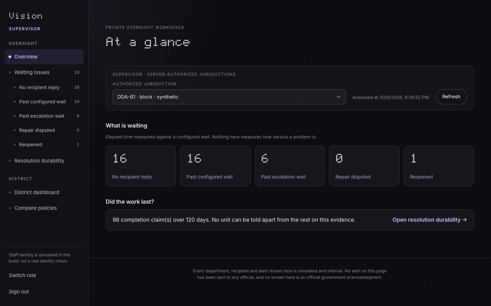
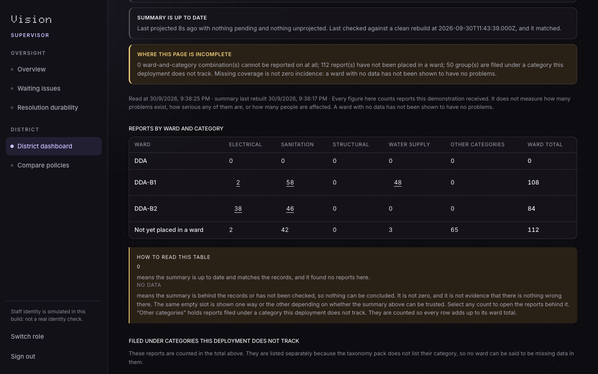
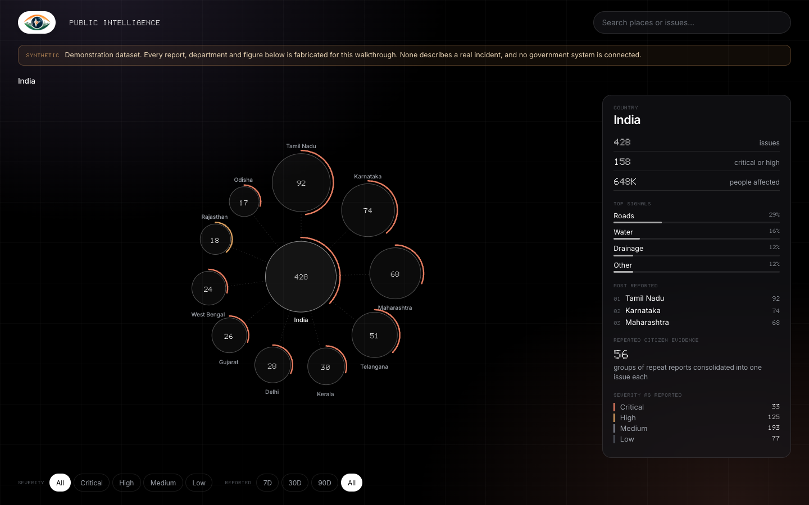
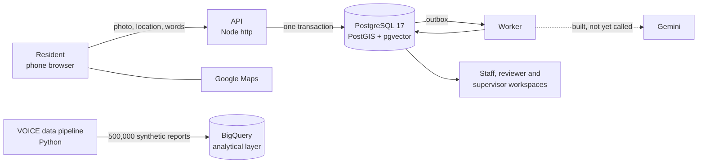

<p align="center">
  
</p>

# Vision

A photo of a broken public thing becomes one tracked issue, goes to the department that owns it, and closes only when the people who reported it say it is fixed.

A leaking classroom roof. A drain that floods the lane every monsoon. A streetlight that has been dark for a month. The person who notices usually files a complaint, gets a ticket number, and hears nothing more. Ten neighbours who notice the same drain file ten complaints, and the department sees ten tickets instead of one problem with ten witnesses.

Vision works the other way round. Reports of the same problem are grouped into one issue. Every step the issue takes is recorded with a date and shown to the people who reported it. The clock the department is working against is on the resident's screen too. And "fixed" is not the department's word alone: the resident confirms it, or disputes it.

Built for **GDG India · Code for Communities**, Digital Public Infrastructure & Governance track.

**Live demo:** <https://vision-api-716180242189.asia-south1.run.app> on Cloud Run in Mumbai, running this build. Choose **Residents** to report and follow a problem, or **Staff** for the department, reviewer and supervisor workspaces.

> **This is a demonstration.** Identity, departments and recipients are simulated, and nothing sent from it reaches a government system. Every person, place, report and figure in the demo data is synthetic unless this page says otherwise, and the screens say so wherever it matters.

---

## What happens to a report

Every report walks the same eight steps. The resident sees each one, with its date, from their own list of reports.

|     | Step                              | Who moves it                                                                                                                                              |
| --- | --------------------------------- | --------------------------------------------------------------------------------------------------------------------------------------------------------- |
| 1   | **Received**                      | The resident: a photo, a location, and a sentence or a voice note if they want                                                                            |
| 2   | **Photo and description checked** | The worker. It decodes the photo, reads its type from the bytes rather than the file name, and fingerprints it so the same photo sent twice is recognised |
| 3   | **Grouped with an issue**         | The matcher, or the resident when the matcher is not sure (_"Is this the same problem?"_)                                                                 |
| 4   | **Sent to a department**          | A versioned routing directory for the category and the ward                                                                                               |
| 5   | **Department acknowledges**       | Department staff                                                                                                                                          |
| 6   | **Work planned**                  | Department staff                                                                                                                                          |
| 7   | **Repair claimed, with a photo**  | Department staff. A claim without a completion photo cannot be confirmed by anyone                                                                        |
| 8   | **You confirm it is fixed**       | The people who reported it. A dispute puts it in front of a supervisor                                                                                    |

While a department holds the issue, the resident also sees the escalation track: _day 17 with the department, past the 7-day wait_, the date it was flagged to a supervisor, the date it escalated. Those waits come from a per-category ageing policy (sanitation and water 7 and 14 days, electrical and structural 3 and 7) that a supervisor can change for one issue, with a written reason.

<table>
  <tr>
    <td width="64%"></td>
    <td width="36%"></td>
  </tr>
</table>

---

## Two doors, four roles

The sign-in page has two doors, **Residents** and **Staff**, and each opens straight into its own workspace. Staff pick their role on the next screen.

<p align="center"></p>

**Residents** report a problem, follow every report they have made, answer _"is this the same problem?"_ when the matcher asks, confirm or dispute a repair, and browse problems near them. The resident interface is in English and Marathi, switchable from the sidebar. The Marathi text is machine-drafted and waiting for a native speaker's review.

**Department staff** see only the issues routed to their responsibility. They accept an issue, assign it, record the recipient's acknowledgment, plan the work and claim completion with a photo. Delivery, internal acceptance and acknowledgment are kept as three separate records, because "sent" and "someone has it" are different facts.

**Reviewers** settle what a machine should not: a possible duplicate, a report the routing directory cannot place, a photo that needs redacting before anything is shown publicly, a correction a resident asked for. Every decision needs a written reason and keeps the state it replaced.

**Supervisors** see what has waited past its configured wait, what was disputed or reopened, and whether completed work lasted. They also get the district dashboard, where every count opens down to the records behind it, and a comparison of how candidates rank under several plausible weightings.

<table>
  <tr>
    <td></td>
    <td></td>
  </tr>
  <tr>
    <td align="center"><sub>Department inbox</sub></td>
    <td align="center"><sub>Supervisor overview</sub></td>
  </tr>
  <tr>
    <td></td>
    <td></td>
  </tr>
  <tr>
    <td align="center"><sub>District dashboard: every figure opens to its records</sub></td>
    <td align="center"><sub>National view: 428 synthetic issues across ten states</sub></td>
  </tr>
</table>

---

## Google in the stack

|                                           | What it does here                                                                                                                                                                                                                                             | State in this build                                                                                                                                                         |
| ----------------------------------------- | ------------------------------------------------------------------------------------------------------------------------------------------------------------------------------------------------------------------------------------------------------------- | --------------------------------------------------------------------------------------------------------------------------------------------------------------------------- |
| **Gemini** · classification               | Reads a report's words and proposes a category and a defect from the deployment's own taxonomy. An answer outside the taxonomy is refused, not guessed.                                                                                                       | Built, and measured against a sealed holdout with `npm run eval:holdout`. **The demo worker does not call it yet**, so every report takes the configured fallback category. |
| **Gemini** · embeddings                   | `gemini-embedding-001` vectors (3,072 dimensions, stored in pgvector) let the matcher see that two differently worded reports describe the same problem.                                                                                                      | Built and measured the same way; not yet called by the worker, so grouping uses category, asset and distance only.                                                          |
| **Gemini** · voice transcription          | Turns a voice note into text. The adapter cannot be constructed without proof that the reporter agreed to voice transcription.                                                                                                                                | Built and tested against generated speech. Voice notes are recorded and stored, not yet transcribed.                                                                        |
| **Google Maps Platform**                  | The Maps JavaScript API draws the resident's location picker and the issue map in the staff, reviewer, supervisor and dashboard workspaces.                                                                                                                   | In use whenever `GOOGLE_MAPS_API_KEY` is set. Every map has a fallback without it.                                                                                          |
| **Cloud Run · Cloud SQL · Cloud Storage** | The API and an internal worker in `asia-south1`, PostgreSQL on Cloud SQL, and evidence in a private bucket mounted into the service.                                                                                                                          | Running at the demo address above.                                                                                                                                          |
| **BigQuery**                              | A separate warehouse over 500,000 synthetic reports, with five interpretable SQL baselines: unmet need, investment gap, execution gap, emerging hotspot and silent need. Ground-truth labels sit in their own dataset, which the analysis account is refused. | Loaded. 60 of 64 parity checks against a local DuckDB run pass. The four that differ are rank bands and boundary reason codes; every final classification matches.          |

Put plainly: Maps, Cloud Run and BigQuery are in use today. The Gemini integrations are written, tested and measured, and connecting them to the worker is the one change between this build and a Gemini-backed demo.

---

## Built to move between states

Nothing about one place is written into the code. A deployment is a set of versioned packs in [`packages/config-packs`](packages/config-packs/src/packs), chosen by `JURISDICTION_PROFILE_ID`: administrative boundaries and their hierarchy, the category taxonomy, the routing directory, and the matching, ageing and confirmation policies. The build fails if production code branches on a district name, a locale or a category (`npm run check:scope`).

The complete pack here, `demo-district-a`, describes a synthetic district with two blocks, four categories and simulated departments. A second, `demo-district-b`, holds only an urban boundary hierarchy (wards under urban local bodies) and exists to test that boundary handling does not assume the first pack's shape. A new language is a locale file and one import line.

The resident app is built for a phone on a poor connection:

- An unfinished report can be kept on the device (the resident is asked first, and it is deleted after 24 hours or at sign-out).
- Every report carries an idempotency key, so a retry after a dropped connection returns the original receipt instead of filing twice.
- A saved receipt can be read back even while the processing worker is down.

---

## Against the brief

| The hackathon asked for   | Where it is                                                                                                                                                                                                                                                          |
| ------------------------- | -------------------------------------------------------------------------------------------------------------------------------------------------------------------------------------------------------------------------------------------------------------------- |
| A working end-to-end flow | Report, check, group, route, acknowledge, plan, claim and confirm. The worker does the checking, grouping and routing; every other step is done by a person in their own workspace. `npm run db:seed:lifecycle` puts one report at every step.                       |
| Google AI                 | Maps, Cloud Run and BigQuery in use; Gemini classification, embeddings and transcription built and evaluated but not yet called by the worker. See [Google in the stack](#google-in-the-stack).                                                                      |
| Real or realistic data    | Real Census 2011 codes for 627 districts in 34 states and union territories, from data.gov.in. In the analytics dataset, 151 of 2,508 district-by-sector infrastructure cells come from real data.gov.in tables. Everything else is synthetic and labelled that way. |
| Built for India           | District, block and ward hierarchies held as configuration packs rather than code, hosting in Mumbai, and a resident app built for a phone on a poor connection.                                                                                                     |
| Multilingual or voice     | English and Marathi throughout the resident app. Voice notes are recorded and stored; transcription is built but not yet switched on.                                                                                                                                |

---

## What we refused to build

Some features were left out on purpose, because they would make the product look more capable than it is.

- **A severity score.** Nothing here measures how dangerous a problem is, so nothing claims to. The staff queue is ordered by a rule someone configured, and the screen says exactly that.
- **Automatic merging by distance.** Two reports are never grouped because they are close together. When the matcher cannot tell, it asks the resident, then a reviewer. A merge can be reversed and keeps its record.
- **"Resolved" on the department's word.** A completion claim stays a claim until the people who reported the problem confirm it.
- **Alerts that pretend to notify.** Escalations are recorded, and the screen says no official was notified, because none was.
- **A percentage we cannot defend.** The held-out evaluation refuses to print a rate until its confidence interval is narrower than twenty points. So far none is, and the report says so.

---

## How it is built



- **One runtime dependency.** The server is Node's own `http` module and [`pg`](https://node-postgres.com). Node 26 runs the TypeScript directly. The browser code is plain TypeScript compiled by `tsc`, with no framework, served under a strict Content Security Policy with no inline script.
- **Nothing is lost, nothing runs twice.** A report, its evidence and the work it starts are committed in one transaction (a transactional outbox). Each processing stage takes a lease with a fencing token, so a worker that stalls cannot overwrite the one that replaced it.
- **Two people, one pothole, one issue.** Grouping runs in a `SERIALIZABLE` transaction and re-checks its candidates before committing, so two reports of the same problem at the same moment cannot open two issues.
- **Private by default.** Original photos stay in private storage; the public only ever sees a copy a reviewer has approved for redaction, and that copy carries no metadata. A report counts towards an issue only when the resident has agreed to how it is processed.
- **Pure rules, tested in isolation.** Lifecycle, matching, ageing, confirmation and the roadmap live in [`packages/domain`](packages/domain/src) with no I/O, and the database layer is tested against a real PostgreSQL.

---

## Run it

You need **Node 26.4** and **Docker**.

```bash
git clone git@github.com:Mr-Daker/Vision.git && cd Vision
cp .env.example .env
npm install
npm run db:up && npm run db:migrate && npm run db:seed
npm run db:seed:lifecycle     # one report at every step of the roadmap
npm run build:web
npm run dev                   # http://127.0.0.1:8787
```

In a second terminal, start the worker that checks, groups and routes reports:

```bash
npm run worker
```

Open <http://127.0.0.1:8787>, then choose **Residents** or **Staff**. Sign-in is simulated, so there is no password.

<details>
<summary>The full supervisor and dashboard demo</summary>

```bash
npm run db:seed:v035          # completion claims waiting for confirmation
npm run db:seed:v036          # issues past their configured wait
npm run db:seed:durability    # four months of completed repairs
npm run context:import        # synthetic population and enrolment context
npm run projects:seed         # synthetic sanctioned projects
npm run summaries:rebuild     # the dashboard's summary tables
```

</details>

### Tests

```bash
npm run check      # formatting, types, import direction, scope literals, secrets, 1,063 unit tests
npm run test:db    # 704 PostgreSQL tests, in a database of their own
```

`test:db` creates and migrates `vision_test` on first use and never touches your development data.

---

## Repository

```
apps/
  api/            HTTP API: resident, staff, reviewer and supervisor routes
  web/            landing page, sign-in, the resident app and the staff workspaces
  worker/         outbox relay: media checks, grouping, routing
  eval/           held-out evaluation, the only code allowed to unseal the holdout
packages/
  domain/         pure rules: lifecycle, matching, ageing, confirmation, roadmap
  adapters/       PostgreSQL, object storage, identity, Gemini
  contracts/      versioned API, event and adapter contracts
  config-packs/   jurisdiction, locale, taxonomy, routing and policy packs
  media/          image decoding, redaction and fingerprinting, no dependencies
  fixtures/       reviewed fixture corpus and the sealed holdout
migrations/       31 forward-only SQL migrations
pipelines/        Python: the VOICE data foundation and the BigQuery layer
docs/foundation/  the roadmap, one document per task (V001–V050)
```

Each roadmap task has its own design document in [`docs/foundation`](docs/foundation). Start with [V001](docs/foundation/V001-scope-and-release-boundaries.md) for scope, [V003](docs/foundation/V003-domain-and-lifecycle-contracts.md) for the lifecycle and [V006](docs/foundation/V006-architecture-and-deployment-decisions.md) for architecture.

---

## Credits

Headlines are set in **BubbledotICG-FinePos** from [OnlineWebFonts](https://www.onlinewebfonts.com), licensed [CC BY 4.0](https://creativecommons.org/licenses/by/4.0/). Body text is **Inter**, licensed SIL OFL 1.1.
