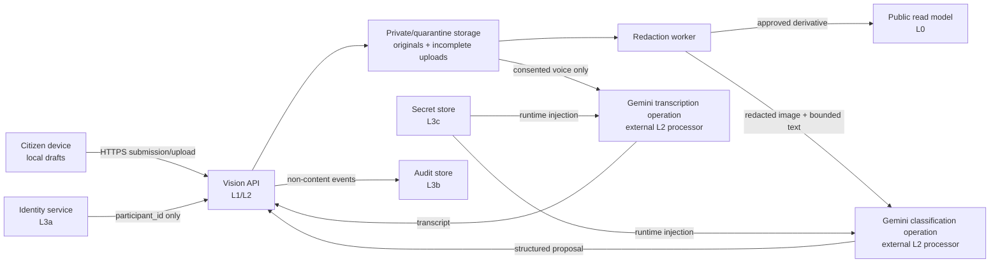

# V005 — Data Classes, Trust Boundaries, and Retention Rules

**Status:** Ready for owner approval  
**Roadmap task:** V005 (Foundation) · **Prerequisites:** V002, V003, V004 · **Owner:** Security + Product

**Revision note (dependency pass after V011–V015):** §3's access model is now implemented as pure policy, and several rules are additionally enforced in SQL — see the note before §4. The retention schedule in §6 is unchanged and still awaits owner approval.

> This is a conservative demonstration policy for consenting test participants. It is not legal certification and does not authorize a public pilot. V056 must approve the real-pilot policy.

## 1. Data classes

| Class         | Meaning                                                    | Examples                                                                     |
| ------------- | ---------------------------------------------------------- | ---------------------------------------------------------------------------- |
| L0 Public     | Approved for unauthenticated display                       | Redacted public evidence, issue summaries, source-labelled aggregates        |
| L1 Internal   | Operational data without citizen content                   | Taxonomy, routing configuration, correlation IDs, non-sensitive metrics      |
| L2 Restricted | Citizen content, pseudonymous activity or precise location | Originals, voice, transcript, descriptions, exact coordinates, model results |
| L3a Identity  | Identity-provider and session mapping                      | `IdentityMapping`, session token hash/state                                  |
| L3b Audit     | Restricted security/privileged-access history              | Exceptional-access and administrator action events                           |
| L3c Secrets   | Credentials unavailable to application users               | Gemini key, signing keys, database credentials                               |

Classification alone never grants access. Every access is scoped by resource, role, jurisdiction and purpose.

## 2. Data inventory and public representation

| Data                                                | Class/location                                      | Public rule                                                                                                                         |
| --------------------------------------------------- | --------------------------------------------------- | ----------------------------------------------------------------------------------------------------------------------------------- |
| Provider subject reference                          | L3a isolated `IdentityMapping` store                | Never public, logged or sent to AI                                                                                                  |
| `participant_id`                                    | L2 application store                                | Never public or exposed to department staff; public/staff views receive counts only                                                 |
| Session token hash/state                            | L3a session store                                   | Citizen sees only their session status; administrators may revoke without reading tokens/provider references                        |
| Consent record                                      | L2 restricted consent store                         | Never public or sent to AI; stores participant ID, notice version/locale, purposes and grant/withdrawal times but no report content |
| Device-reported precise coordinates and accuracy    | L2 submission store                                 | Only a risk-reviewed/coarsened point or named area may be public                                                                    |
| Original citizen or staff resolution photo/document | L2 private object storage                           | Never public; only approved redacted derivative may be released                                                                     |
| Original voice recording                            | L2 private object storage                           | Never public; may be sent only to the disclosed transcription processor                                                             |
| Text/voice transcript                               | L2 restricted record                                | Only reviewed/redacted text may be public                                                                                           |
| Pre-release derivative                              | L2 restricted object                                | Reviewer/assigned staff only                                                                                                        |
| Released derivative                                 | L0 public object/read model                         | Public after recorded redaction approval                                                                                            |
| Gemini request                                      | L2 in transit                                       | Do not duplicate raw request bodies into application logs; retain input hash and provider metadata                                  |
| Raw model result                                    | L2 restricted result                                | Validated/bounded fields only may enter public read models                                                                          |
| Confidence/trust signals                            | L2                                                  | Public UI shows reasons/review state, never an uncalibrated truth probability                                                       |
| Device-local draft                                  | L2 on the citizen's device                          | Never server-accessible before submission                                                                                           |
| Incomplete server upload                            | L2 quarantine object storage                        | Never public; automatically expires if completion is not validated                                                                  |
| Application logs                                    | L1                                                  | Never public and never contain L2/L3 data                                                                                           |
| Domain-event envelope                               | L2 when an actor pseudonym is present; otherwise L1 | Public timeline is a separate sanitized projection; event payloads contain no citizen content                                       |
| Audit events                                        | L3b                                                 | Security/administrator access only                                                                                                  |
| Aggregates                                          | L0 only after threshold/source review               | Show formula, denominator, coverage and as-of date                                                                                  |

## 3. Resource- and purpose-based access

| Resource                      | Default human access                                                               | Exceptional access and audit                                                                                                                                                                        |
| ----------------------------- | ---------------------------------------------------------------------------------- | --------------------------------------------------------------------------------------------------------------------------------------------------------------------------------------------------- |
| Original photo/voice          | None                                                                               | Authorized reviewer may request time-limited access for a named redaction/evidence-review purpose. Assigned staff access requires the same explicit justification. Every access emits an L3b event. |
| Pre-release redacted evidence | Reviewer; assigned staff/supervisor within jurisdiction                            | Normal scoped access logging                                                                                                                                                                        |
| Precise coordinates           | Reviewer and assigned staff only when required for routing/action                  | Purpose and issue scope logged; never included in shared logs                                                                                                                                       |
| Transcript/free text          | Reviewer; assigned staff within jurisdiction                                       | Public release requires recorded redaction approval                                                                                                                                                 |
| Participant information       | Citizen sees own reports; reviewer may see a per-issue pseudonymous handle         | Staff/supervisors see only distinct-participant counts, never the stable `participant_id` or cross-issue activity                                                                                   |
| Identity mapping              | Identity service only                                                              | No human UI access in the hackathon; access attempts are audited                                                                                                                                    |
| Sessions                      | Citizen owns session; administrator can revoke by opaque session ID                | Token/provider reference remains unreadable                                                                                                                                                         |
| Consent record                | Citizen may view their current grant/withdrawal state; consent service enforces it | Security/Product may inspect a versioned proof record; access is audited and report content is not present                                                                                          |
| Audit trail                   | Security/administrator                                                             | Audit viewing is itself logged                                                                                                                                                                      |
| Local draft                   | Citizen device only                                                                | No server exception exists                                                                                                                                                                          |
| Incomplete server upload      | Upload-validation/cleanup workers only                                             | Human access requires the same exceptional-original procedure                                                                                                                                       |

Service identities receive only the records/actions required by their adapter contract. A general worker role does not inherit access to all L2/L3 data.

**Where these rules are now enforced** (added in the V011–V015 dependency pass): the resource-and-purpose model above is implemented as pure policy in `packages/domain/src/authorization.ts` ([V015](V015-authorization-and-private-data-boundaries.md)) — `identity_mapping.read` is denied to every application role including administrator, and reading a private original requires a named purpose and returns `auditRequired: true`. Several of these rules are additionally enforced in SQL by the [V012](V012-database-schema-and-invariants.md) schema: a public derivative requires an approved redaction decision, `identity_mapping.provider_subject_hash` must match a 64-hex shape so a raw provider reference cannot be stored, erasure must null every restricted column while keeping a non-content tombstone, and reference-only source material cannot carry a snapshot. Retention durations in §6 remain proposals pending owner approval; nothing in that schedule is automated yet.

## 4. Trust boundaries



The hackathon uses simulated identity and recipient adapters, but real Gemini inference. Raw audio may cross to Google only for the disclosed Gemini transcription operation. No identity reference, session token or unrelated precise location accompanies that request. A transcript is treated as untrusted L2 text and redacted before any public release.

## 5. Demonstration consent notice

> **Draft — owner approval required before using real participant data.**

```text
Vision is an early demonstration, not an official government complaint channel.

If you submit a test report, Vision processes the photo, description, your
device-reported location and its accuracy, and—if you choose voice—the audio
recording. The location does not prove you were physically present.

We send an approved/redacted image and limited report text to Google's Gemini
service for classification. If you use voice, the recording is sent securely
to Gemini to produce a transcript. We do not send your identity-provider
reference or session token with these requests.

Original media remains private. A reviewed/redacted derivative may be displayed
in the demonstration. Identity and government receipt are simulated, and no
department is guaranteed to receive or act on the report.

You may withdraw before submitting or ask the team contact shown beside this
notice to delete your demonstration data. Non-content security events may be
retained temporarily after identity links and submitted content are removed.
```

The deployed notice must include a real team contact, the dates of the demonstration and a link to the detailed retention schedule. The same meaning must be human-reviewed and available in Marathi (`mr-IN`) and English (`en-IN`); consent records store the notice version and locale shown. Adding another locale requires a new reviewed notice resource, not a new privacy rule.

## 6. Demonstration retention schedule

These defaults minimize retained data and become active only after Product/Security approval.

| Data                                   | Default retention/trigger                                                                                                                    |
| -------------------------------------- | -------------------------------------------------------------------------------------------------------------------------------------------- |
| Device-local draft                     | Delete after 7 days of inactivity; citizen can clear immediately                                                                             |
| Incomplete server upload               | Delete within 24 hours unless upload completion is validated                                                                                 |
| Original voice                         | Delete within 24 hours after successful transcription; retain failed/quarantined audio no longer than 7 days for consented retry/review      |
| Original photo                         | Delete 30 days after the demonstration ends, or earlier on an approved deletion request                                                      |
| Transcript and private description     | Delete 30 days after the demonstration ends, or earlier on deletion request                                                                  |
| Released/redacted derivative           | Remove at demo teardown or when its last supporting consent/source is withdrawn                                                              |
| Gemini raw request duplication         | Do not store; retain input hash, provider request ID, model/prompt version and timing only                                                   |
| Raw/validated model output             | Delete 30 days after the demonstration ends; derived public fields follow their issue record                                                 |
| Identity mapping                       | Erase 30 days after the demonstration ends, or earlier on deletion request                                                                   |
| Session                                | Delete 24 hours after expiry/revocation                                                                                                      |
| Consent record                         | Retain 90 days after demonstration end or withdrawal as non-content proof; participant reference resolves only to a tombstone after deletion |
| L1 logs                                | 30 days                                                                                                                                      |
| L3b audit events                       | 90 days after demonstration end unless an active incident requires a documented extension                                                    |
| Public demonstration issues/aggregates | Remove 30 days after demonstration end unless converted to fully synthetic examples                                                          |

## 7. Public, private and AI representation rules

- No public view exposes real identity, global participant ID, original media, raw transcript or precise coordinates.
- A public evidence object requires a redaction decision and derivative provenance.
- Reports involving identifiable children or bystanders are quarantined until redacted. Demo fixtures should avoid identifiable people entirely.
- The AI receives only the minimum input for its named operation. Citizen content is untrusted and cannot provide instructions to the system.
- AI output is a proposal validated against a versioned schema. It cannot route authoritatively, change credentials, write status, or call arbitrary URLs.
- Gemini/transcription and classification calls record provider, model, prompt/schema version, input hash, request time, outcome and cost metadata without logging raw content.
- Secrets are backend-only L3c values and never appear in client bundles, source control, model context or logs.

## 8. Logging, deletion and restore rules

Logs and event payloads must exclude originals/URLs, descriptions, transcripts, exact coordinates, provider subjects, session tokens and secrets. Correlation IDs join operational events to restricted records under normal authorization.

A valid participant deletion request performs all of the following:

1. erase the `IdentityMapping` and active sessions;
2. delete precise location, originals, incomplete uploads, fingerprints, transcripts, descriptions and retained AI results attributable solely to that participant, leaving only non-content submission/evidence tombstones;
3. withdraw their public derivatives unless another documented lawful/consented source supports them;
4. close active public derivatives, mark their participation non-counting with a deletion reason, and recompute public aggregates while retaining non-content referential links;
5. tombstone the `Participant` so its random identifier no longer resolves to identity/content but event ordering and anti-double-count history remain coherent;
6. add the deletion to a restricted deletion ledger and reapply it after every backup restore;
7. retain only non-content audit facts required to demonstrate that deletion occurred.

The non-content `ConsentRecord` may remain for the limited period in §6 to prove which notice and purposes were presented; after participant tombstoning it cannot resolve to identity or submitted content.

The participant notice must say that non-identifying audit/tombstone records may remain temporarily. No restore procedure may be called tested until a deletion survives an end-to-end restore drill.

## 9. Pilot approval gates

Before real users or a government partner enter a pilot, V056 must approve:

- final notice, consent capture and deletion-request channel;
- applicable Indian privacy/legal obligations at the actual launch date;
- handling of children, bystanders and sensitive locations;
- processor terms, provider data use/retention and cross-border processing for AI, storage and identity;
- final retention, backup and incident-notification policy;
- real identity attributes, eligibility rules and separation from issue content;
- public-location precision and partner access by jurisdiction;
- whether raw voice is permitted to reach the selected transcription processor.

One hosting region does not establish end-to-end residency across every provider. This document does not claim compliance certification or partner approval.

## 10. Approval record

| Decision                            | Proposed default                       | Approved by/date |
| ----------------------------------- | -------------------------------------- | ---------------- |
| Consent wording and team contact    | §5; contact still required             | Pending          |
| Demonstration retention schedule    | §6                                     | Pending          |
| Gemini processing of optional voice | Disclosed opt-in; no identity included | Pending          |
| Public location precision           | Coarsened/risk-reviewed only           | Pending          |
