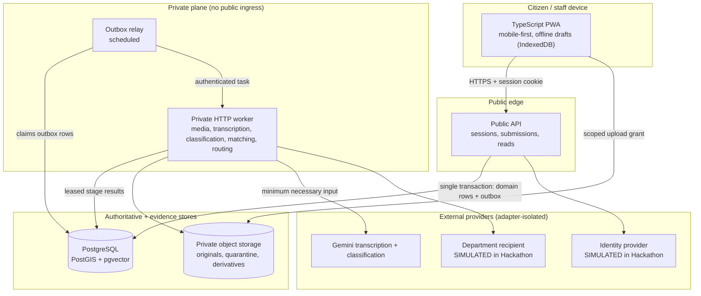

# V006 — Initial Architecture and Deployment Decisions

**Status:** Ready for owner approval
**Roadmap task:** V006 (Foundation) · **Prerequisites:** V003, V005 · **Owner:** Platform + Backend
**Companions:** [V003 domain contracts](V003-domain-and-lifecycle-contracts.md) · [V005 privacy and retention](V005-data-privacy-and-retention.md) · [V001 Appendix G future-extension contract](V001-scope-and-release-boundaries.md) · [V007 workspace](V007-development-workspace.md)

**Revision note (after V016–V020):** D3, D7 and D14 now record what was actually decided when the endpoints and the interface were built: no HTTP framework and no frontend framework were adopted, and D8's PostgreSQL repositories exist. §9 additionally records why `apps/web` may not import `@vision/adapters`.

**Revision note (dependency pass after V011–V015):** D8, D14/D15, §5, §8 and §11 recorded expectations that V012/V013 have since settled; each now states what was actually measured or decided. The deferrals that remain deferred are unchanged.

> This document records architecture _decisions and their triggers_. It is not a deployment. **No cloud** project, managed database, bucket, queue, or domain exists, and none is created by V006 — cloud provisioning is V051. A _local_ containerized database now exists (V013), which is what allowed §5's connection ceiling and §11's parity claims to be checked rather than assumed.

## 1. Decision summary

| #   | Decision                             | Choice                                                                                                                                                                 | Reversibility                                               |
| --- | ------------------------------------ | ---------------------------------------------------------------------------------------------------------------------------------------------------------------------- | ----------------------------------------------------------- |
| D1  | Repository shape                     | One repository, npm workspaces, shared contract/domain packages                                                                                                        | Cheap — package boundaries already enforce import direction |
| D2  | Runtime                              | Node.js (pinned in [V007](V007-development-workspace.md)), TypeScript everywhere                                                                                       | Moderate                                                    |
| D3  | Deployable units                     | Three: citizen/staff PWA, public API, private worker. The PWA is built by `tsc` with no bundler; locally the API serves it so the strict-cookie/CSRF pair works (V019) | Cheap                                                       |
| D4  | Authoritative store                  | PostgreSQL + PostGIS + pgvector                                                                                                                                        | Expensive — this is the system of record                    |
| D5  | Evidence bytes                       | Private object storage, never database columns                                                                                                                         | Moderate                                                    |
| D6  | Async work                           | Transactional outbox + relay + authenticated private HTTP worker                                                                                                       | Moderate                                                    |
| D7  | API transport                        | Transport-agnostic services behind a thin HTTP adapter. **Resolved at V018/V019**: no framework was adopted — see D14                                                  | Cheap                                                       |
| D8  | Persistence access                   | Repository ports. PostgreSQL implementations of the identity/session ports landed in V018 (`postgres-repositories.ts`); the in-memory ones remain for fast unit tests  | Cheap by construction                                       |
| D9  | Scope configuration                  | Versioned configuration packs, never code branches                                                                                                                     | Cheap, enforced by CI                                       |
| D10 | Region                               | Single India region for compute, database, and private storage                                                                                                         | Moderate                                                    |
| D11 | BigQuery                             | **Deferred** — trigger in §8                                                                                                                                           | n/a                                                         |
| D12 | Redis                                | **Deferred** — trigger in §8                                                                                                                                           | n/a                                                         |
| D13 | Native mobile attestation            | **Deferred** — trigger in §8                                                                                                                                           | n/a                                                         |
| D14 | HTTP framework                       | **Resolved at V018/V019: none adopted.** A thin handler over `node:http` carries sessions, uploads, submissions and static files; no dependency proved necessary       | Cheap — the handler is one file                             |
| D15 | ORM / query builder / migration tool | **Resolved at V012/V013**: raw SQL plus a hand-written checksummed runner. No ORM adopted                                                                              | Moderate                                                    |

## 2. Component topology



**Why three deployables, not one and not many:** the worker holds provider credentials, decodes untrusted media, and runs long operations; the API must stay small, fast, and publicly reachable. Splitting those two is a real trust and resource boundary ([V005 §§3, 7](V005-data-privacy-and-retention.md)). Splitting further — a service per capability — is rejected: one team, one domain model, and cross-entity transactions in [V003 §5](V003-domain-and-lifecycle-contracts.md) (`finalize_issue_match` writes match, issue, evidence links, participation, events, and outbox atomically) would become a distributed-transaction problem for no measured benefit.

## 3. Authoritative records

Exactly one store is authoritative for each fact. Everything else is a derived projection that must be rebuildable.

| Fact                                                                 | Authoritative home                                                                   | Derived / non-authoritative copies          | Rebuild rule                                           |
| -------------------------------------------------------------------- | ------------------------------------------------------------------------------------ | ------------------------------------------- | ------------------------------------------------------ |
| Domain entities in [V003](V003-domain-and-lifecycle-contracts.md) §2 | PostgreSQL rows                                                                      | Public read models, analytics summaries     | Replay from rows + `StatusEvent`                       |
| Domain history                                                       | `StatusEvent` (append-only)                                                          | Public timeline projection                  | Sanitized projection, never the source                 |
| Active canonical issue                                               | `IssueAlias` active-edge closure ([V003 §7](V003-domain-and-lifecycle-contracts.md)) | Cached "current issue" on any read model    | Recompute by following active edges (max 16 hops)      |
| Evidence bytes                                                       | Private object storage                                                               | Derivatives, thumbnails                     | Regenerate from original while it exists               |
| Evidence ↔ issue association                                         | `IssueEvidenceLink` active row                                                       | Any denormalized `issue_id` on a read model | One active link per evidence item                      |
| Participation counts                                                 | `IssueParticipation` rows                                                            | Displayed corroboration counts              | Distinct `participant_id` over alias closure           |
| Identity ↔ participant                                               | `IdentityMapping` (isolated L3a)                                                     | **None permitted**                          | Not rebuildable; erasure is intentional                |
| Session validity                                                     | `Session` row (`expires_at`/`revoked_at`)                                            | Cookie held by client                       | Cookie is a bearer credential, never a source of truth |
| Consent                                                              | `ConsentRecord` grants                                                               | Purpose checks at call sites                | Re-read before each optional-purpose operation         |
| Pending async work                                                   | Outbox rows                                                                          | Queue message in flight                     | Queue is a delivery hint; the row is the truth         |
| Source provenance                                                    | `SourceRecord`                                                                       | Imported asset/jurisdiction rows            | Re-import from snapshot only when licence permits      |

Two rules follow and are testable: **(a)** a queue message alone never proves work is owed — the outbox row does; **(b)** a session cookie never proves a live session — the row does.

## 4. Service identities and least privilege

Each deployable runs as its own identity. No shared "app" credential exists. Classes refer to [V005 §1](V005-data-privacy-and-retention.md).

| Identity                                                    | May read                                                                   | May write                                   | Explicitly denied                                                                                                                           |
| ----------------------------------------------------------- | -------------------------------------------------------------------------- | ------------------------------------------- | ------------------------------------------------------------------------------------------------------------------------------------------- |
| `web` (PWA build/CDN)                                       | Public static assets                                                       | Nothing server-side                         | All L2/L3; no database or bucket credentials ever reach the client bundle                                                                   |
| `api`                                                       | L1 config; L2 rows within request authorization; `Session`/`ConsentRecord` | Submissions, sessions, consent, outbox rows | Cannot read `IdentityMapping.provider_subject_reference`; cannot read originals in bulk; no provider API keys except the identity adapter's |
| `identity-svc` (logical, in-process for Hackathon — see §7) | `IdentityMapping` (L3a)                                                    | `IdentityMapping`, `Participant`            | Cannot read submissions, evidence, or issues                                                                                                |
| `worker`                                                    | L2 rows for leased stages; originals for its stage                         | Stage results, derivatives, events, outbox  | Cannot read `IdentityMapping`; cannot serve public traffic; no public ingress                                                               |
| `relay`                                                     | Outbox rows only                                                           | Outbox row claim/ack fields only            | No evidence, no identity, no domain mutation                                                                                                |
| `audit-sink`                                                | Nothing                                                                    | L3b audit events (append-only)              | Cannot read the events it stores back into the app                                                                                          |
| `deployer` (CI)                                             | Build artifacts                                                            | Deploy revisions                            | No production data, no L3c runtime secret values                                                                                            |

Secret handling: all L3c values (Gemini key, database credentials, session-signing key, identity-mapping HMAC key) are injected at runtime from a secret manager, are never committed, and never appear in client bundles, logs, events, or model context ([V005 §7](V005-data-privacy-and-retention.md)). [V007](V007-development-workspace.md) enforces this with a committed-secret check in CI.

## 5. Connection budget

PostgreSQL connections are a hard, shared resource, and exhausting them is the most likely self-inflicted outage. The budget is a **formula with a verification gate**, not a vendor constant:

```
workload_capacity = instance_max_connections − superuser_reserved − admin_reserve
Σ over workload services (max_instances × pool_max) ≤ workload_capacity
```

Hackathon-scale starting allocation (to be confirmed against the real instance at V013 and load-checked at V049):

| Service                | max instances | pool max | Peak connections |
| ---------------------- | ------------- | -------- | ---------------- |
| `api`                  | 4             | 5        | 20               |
| `worker`               | 3             | 4        | 12               |
| `relay`                | 1             | 2        | 2                |
| Migrations (transient) | 1             | 2        | 2                |
| **Workload subtotal**  |               |          | **36**           |
| Admin/debug reserve    | —             | —        | **6 (separate)** |

Rules: every service sets both `max_instances` **and** `pool_max` (setting one without the other makes the budget meaningless); statement and idle-transaction timeouts are mandatory; a pool retry never substitutes for retrying the full unit of work, because a failed transaction must be re-run, not resumed. The initial gate is unambiguous: `instance_max_connections >= superuser_reserved + 6 admin + 36 workload`, and the measured `workload_capacity` must be at least 36. **V013 has now measured the local stack**: the development container runs with `max_connections=50`, a 15 s `statement_timeout` and a 30 s idle-in-transaction timeout, which clears the 36-connection workload gate with headroom. A managed instance is still unprovisioned, so V049 must re-measure against the real one and revise this table from load results. If measured workload capacity is below 36, instance counts drop before pool sizes.

## 6. Region and data-location decisions

| Concern                | Decision                                                                          | Rationale / limit                                                                                                                                                                               |
| ---------------------- | --------------------------------------------------------------------------------- | ----------------------------------------------------------------------------------------------------------------------------------------------------------------------------------------------- |
| Compute (API, worker)  | Single India region                                                               | Sangli-district demonstration; lowest latency for in-country testers                                                                                                                            |
| PostgreSQL             | Same India region as compute                                                      | Cross-region database calls would dominate request latency                                                                                                                                      |
| Private object storage | Same India region                                                                 | Keeps originals and derivatives co-located with the database                                                                                                                                    |
| Backups                | Same-country storage; retention per [V005 §6](V005-data-privacy-and-retention.md) | Restores must reapply the deletion ledger ([V005 §8](V005-data-privacy-and-retention.md))                                                                                                       |
| AI provider processing | **Not asserted**                                                                  | Gemini endpoint/processing location and data-use terms are a V056 pilot review item; one hosting region does not establish end-to-end residency ([V005 §9](V005-data-privacy-and-retention.md)) |
| CDN for static assets  | Anywhere; public L0 assets only                                                   | Never used for evidence or private media                                                                                                                                                        |

The exact region identifier is deliberately left to V051 (deployment), because it depends on the hosting account and service availability that no one has provisioned. What is decided now: **one region for compute + database + private storage, in India, and no cross-region data path for L2/L3 data.**

## 7. Durable task delivery

1. A request commits domain rows **and** its outbox rows in one transaction, then returns a receipt. Nothing is enqueued before commit.
2. A scheduled relay claims unsent outbox rows in bounded batches and calls the private worker over authenticated HTTP.
3. The worker acquires a **lease with a fencing token** on a uniquely keyed processing stage, does the work, and commits the stage result plus any follow-on outbox rows before acknowledging.
4. Delivery is **at-least-once and unordered**. Duplicate delivery must be a no-op at the domain level; an expired lease holder must never overwrite a newer holder's result.
5. Terminal failures land in an explicit reviewable failed state. There is no reliance on a provider dead-letter queue.
6. Idempotent database effects do **not** imply idempotent external cost: a crash after a paid Gemini call may cause a second paid call. Results are cached by input hash to bound this ([V005 §6](V005-data-privacy-and-retention.md) forbids storing the raw request).

This is exercised by V017 and adversarially tested by V022/V048; V006 only fixes the design.

## 8. Deferred components and their triggers

Nothing below is "not needed." Each is **not yet justified by a measurement or an approval**, and each has a concrete trigger. Adding any of them before its trigger is a defect against this document.

| Component                                                         | Why deferred now                                                                                                                                                                                                                                                                                                                                                                                                                                               | Concrete trigger to adopt                                                                                                                                                                                                                                                             | Interim approach                                                                                                                                                 |
| ----------------------------------------------------------------- | -------------------------------------------------------------------------------------------------------------------------------------------------------------------------------------------------------------------------------------------------------------------------------------------------------------------------------------------------------------------------------------------------------------------------------------------------------------- | ------------------------------------------------------------------------------------------------------------------------------------------------------------------------------------------------------------------------------------------------------------------------------------- | ---------------------------------------------------------------------------------------------------------------------------------------------------------------- |
| **BigQuery**                                                      | The demonstration is one district, one category, with a synthetic corpus. Analytics ([V037–V039](../../deliverables/Vision-development-checklist.md)) are defined as replayable PostgreSQL summaries. A warehouse would add ingestion, deduplication, reconciliation, and partition-cost work while the authoritative model is still changing, and its declared keys are not enforced — so it cannot be the system of record regardless.                       | Measured historical scans degrade operational PostgreSQL latency past the V049 budget, **or** summary rebuild time exceeds its agreed window, **or** a pilot partner requires retention/scan volumes beyond the instance. Roadmap gate: V068, which also permits a recorded deferral. | Materialized summary tables with versioned metric definitions, rebuildable from events.                                                                          |
| **Redis**                                                         | Nothing in the Hackathon path needs a second data store: sessions are authoritative rows (§3), rate limits are per-instance plus database-backed quotas, and job state is the outbox/stage tables. Adding Redis would create a second source of truth for session validity — directly contradicting §3 — and a new availability dependency on the login path.                                                                                                  | Measured p95 read latency on hot public reads exceeds the V049 budget with the database correctly indexed, **or** cross-instance rate limiting proves insufficient under measured abuse, **or** connection-budget pressure (§5) is traced to cacheable reads.                         | Bounded-TTL in-process caches for public L0 summaries only, with a freshness watermark; never for identity or session decisions.                                 |
| **Native mobile attestation**                                     | Requires a native app, which [V001 Appendix B](V001-scope-and-release-boundaries.md) excludes. More importantly it would imply a presence/integrity claim that [V002](V002-capability-evidence-matrix.md) rows 3–4 forbid: attestation evidences a device, never a person's physical presence. Shipping it now would create exactly the overclaim this project is designed to avoid.                                                                           | An approved pilot onsite-evidence policy (V059) explicitly requires stronger device signals **after** a threat-model review, and V056 approves the privacy implications. Roadmap gate: V059/V065.                                                                                     | Browser Geolocation with disclosed accuracy, labeled "consistent with," never "proof of presence."                                                               |
| **HTTP framework (e.g. Fastify)**                                 | V009's session work is transport-agnostic; committing a framework before real endpoints exist (V018/V019) would be a guess. The session service is written behind a port so the transport can be swapped without touching session logic.                                                                                                                                                                                                                       | V018 (durable submission endpoint) or V019 (citizen interface) needs routing, schema validation, and middleware at scale.                                                                                                                                                             | Thin Node built-in HTTP adapter over the session service, with real cookies and CSRF ([V009](V009-sessions-and-simulated-identity.md)).                          |
| **ORM / query builder** — _resolved at V012/V013, no ORM adopted_ | The concern was that choosing an ORM first would bias the schema toward the tool instead of the [V003](V003-domain-and-lifecycle-contracts.md) invariants (partial unique indexes, effective-dating, `unique_where` constraints) that are the hard part. That proved correct: those constraints are expressed directly in SQL, and a hand-written checksummed runner (`tools/db.mjs`) applies them. Revisit only if query construction becomes the bottleneck. | V012, when migrations are authored; the tool must support raw SQL, partial/expression indexes, and forward-only versioned migrations.                                                                                                                                                 | Versioned SQL migration directory and runner contract scaffolded in [V007](V007-development-workspace.md); no domain migrations authored.                        |
| **Message broker (Kafka/PubSub fan-out)**                         | The outbox+relay pattern (§7) covers at-least-once delivery for a single consumer set. A broker adds operational surface with no second consumer to serve.                                                                                                                                                                                                                                                                                                     | A second independent consumer (e.g. warehouse ingestion, notification service) exists **and** outbox relay throughput is measured as the bottleneck.                                                                                                                                  | Outbox + relay + private worker.                                                                                                                                 |
| **Notification channels (SMS/email/push)**                        | Requires provider onboarding, consent handling, and delivery reconciliation, and delivery must never be presented as agency acknowledgment ([V002](V002-capability-evidence-matrix.md) row 16).                                                                                                                                                                                                                                                                | Roadmap gate V070, with consent and provider review; a reviewed decision to keep only the web receipt is a valid outcome.                                                                                                                                                             | Durable receipt + issue timeline in the app.                                                                                                                     |
| **Kubernetes / self-managed compute**                             | Three small stateless services do not justify cluster operations for a hackathon team.                                                                                                                                                                                                                                                                                                                                                                         | Sustained scale or scheduling requirements that a managed container runtime cannot meet.                                                                                                                                                                                              | Managed container runtime with per-service identities and max-instance caps.                                                                                     |
| **Separate identity microservice**                                | At Hackathon scale `identity-svc` is a **logical policy boundary inside the API process**, not a separately enforced runtime identity. The API composition root necessarily wires its repositories, so V007 package-import checks do not prove storage isolation. A network hop would add failure modes before a real provider secret exists.                                                                                                                  | Real identity integration (V057) introduces provider secrets and audit obligations; before that release, use a separate process and database role or an equivalently reviewed isolation control.                                                                                      | In-process identity module; restricted repository interfaces and tests provide defence in depth, while process/credential isolation remains explicitly deferred. |

## 9. Package layout and import direction

Implemented in [V007](V007-development-workspace.md); recorded here as the architectural rule.

| Layer        | Location                  | May import                                | Must never import            |
| ------------ | ------------------------- | ----------------------------------------- | ---------------------------- |
| Contracts    | `packages/contracts`      | Nothing (leaf)                            | Any other workspace package  |
| Domain       | `packages/domain`         | contracts                                 | adapters, apps               |
| Adapters     | `packages/adapters`       | contracts, domain                         | apps                         |
| Config packs | `packages/config-packs`   | contracts                                 | domain, adapters, apps       |
| Fixtures     | `packages/fixtures`       | contracts                                 | domain, adapters, apps       |
| Apps         | `apps/api`, `apps/worker` | contracts, domain, adapters, config-packs | each other                   |
| Web app      | `apps/web`                | contracts, domain                         | adapters, config-packs, apps |

Rationale: the domain must be testable without a database, a network, or a UI — which is also what makes V009/V010 implementable before V012 exists (D8). CI enforces the direction; a violation fails the build rather than being caught in review.

`apps/web` is narrower than the other apps because it runs in a browser (V019). `@vision/adapters` imports `node:fs` and `pg`, which have no meaning there and would drag server code into the client; contracts and domain are free of Node built-ins, which `npm run check:browser-safe` verifies rather than assumes. There is no bundler, so the browser build rewrites those two specifiers to absolute paths.

## 10. Configuration packs, not code branches

Per [V001 Appendix G](V001-scope-and-release-boundaries.md), scope is data. Jurisdiction profile, locale resources, taxonomy pack, routing directory, and policy versions are versioned configuration loaded through contract interfaces. Production code must not branch on `Sangli`, `mr-IN`, or `school-infrastructure`; [V007](V007-development-workspace.md) ships a CI check that fails on such literals in production paths, and portability is proved by loading a second synthetic pack in tests.

Every issue records the pack versions that produced its decisions, so a later pack change never silently rewrites history.

## 11. Local development parity and its honest limits

| Concern        | Local                                                                                                | Deployed                             | Accepted divergence                                                                                     |
| -------------- | ---------------------------------------------------------------------------------------------------- | ------------------------------------ | ------------------------------------------------------------------------------------------------------- |
| Database       | Containerized PostgreSQL 17.11 + PostGIS 3.6.4 + pgvector 0.8.6, capability verified by query (V013) | Managed PostgreSQL                   | Managed backups/HA/failover are not reproduced locally; no restore drill until V062                     |
| Object storage | Local filesystem adapter behind the storage port                                                     | Managed private buckets              | Signed-URL semantics differ; contract tests pin the behavior that matters                               |
| Task delivery  | In-process/loopback relay behind the task port                                                       | Managed queue + authenticated worker | Local delivery is more orderly than production; V022 must inject duplicates and reordering deliberately |
| Identity       | Simulated adapter (V009)                                                                             | Simulated adapter (Hackathon)        | None during Hackathon — this is the same code path, which is the point                                  |
| Recipient      | Simulated adapter (V010)                                                                             | Simulated adapter (Hackathon)        | None during Hackathon                                                                                   |
| Gemini         | Deterministic stub locally; real endpoint in the demo path (V023)                                    | Real endpoint                        | Stub responses are schema-valid but not model-quality; only V046 measures quality                       |

No production credential is required to run the workspace, and none is embedded in it ([V007](V007-development-workspace.md) verifies this).

## 12. Consequences accepted

- **PostgreSQL is a single point of failure** for the demonstration. Accepted: restore-drill obligations sit at V062, and the Hackathon does not claim an availability figure.
- **At-least-once delivery pushes idempotency into the domain.** Accepted deliberately: the alternative (assuming exactly-once) is the more expensive failure.
- **Deferring the HTTP framework means V018 will do integration work** the session service does not need today. Accepted as smaller than choosing wrong now.
- **In-process identity isolation is a policy boundary, not a security boundary.** Accepted for the Hackathon with simulated identity only; V057 must add and verify process/credential isolation before any real provider secret exists.
- **A single region means no regional failover.** Accepted; not claimed otherwise.

## 13. Approval record

| Decision                                                                                                                             | Proposed | Approved by / date                        |
| ------------------------------------------------------------------------------------------------------------------------------------ | -------- | ----------------------------------------- |
| D1–D10 architecture and deployment choices                                                                                           | §1       | Pending                                   |
| Connection-budget formula and starting allocation                                                                                    | §5       | Pending (values re-verified at V013/V049) |
| Deferral set and triggers (BigQuery, Redis, native attestation, framework, ORM, broker, notifications, Kubernetes, identity service) | §8       | Pending                                   |
| Region rule (one India region for compute/database/private storage)                                                                  | §6       | Pending (exact region named at V051)      |

V012 migrations must not begin, and no cloud resource may be provisioned, until Platform and Backend approve this document together with [V003](V003-domain-and-lifecycle-contracts.md).
